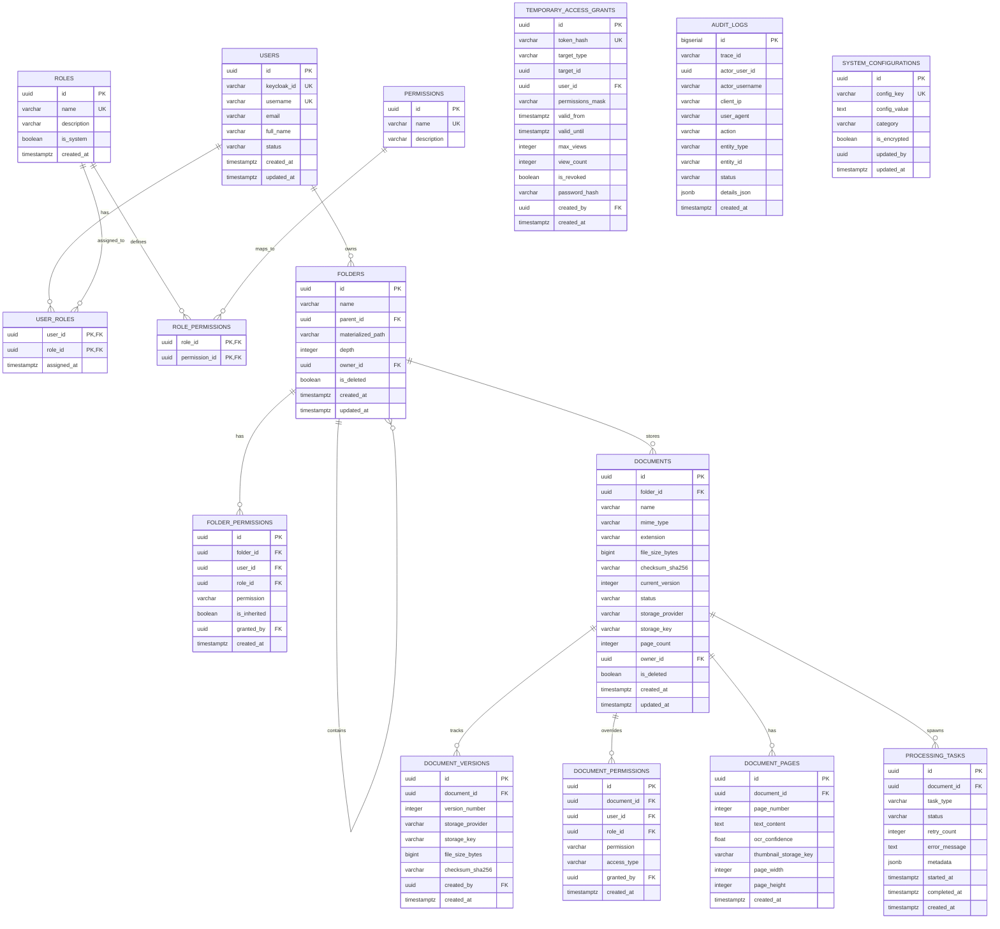

# 02 - Database Entity Relationship Design (ERD)

## 1. Schema Overview & Design Principles

The EDRMS database schema is engineered for **PostgreSQL 16** with the following design principles:
- **Hierarchical Performance**: Folders use a materialized path pattern (compatible with the PostgreSQL `LTREE` extension) allowing sub-millisecond retrieval of deeply nested trees and ancestral permission resolution in a single query.
- **Strict Immutability for Audit**: The `audit_logs` table is append-only, with cryptographically verifiable payload checksums.
- **Decoupled Module Tables**: Inter-module relationships rely on UUID foreign keys rather than tight JPA cascading, preserving clean boundaries for future microservice extraction.
- **Page-Level Granularity**: Document pages are modeled as first-class child entities to enable direct page-level search result navigation and page thumbnail caching.

---

## 2. Mermaid Entity Relationship Diagram



---

## 3. Detailed Data Dictionary

### 3.1 Identity & Access (`users`, `roles`, `permissions`)
- `users`: Synchronized JIT (Just-In-Time) from Keycloak JWT claims upon login.
- `permissions`: Pre-populated system catalog (`VIEW`, `UPLOAD`, `DOWNLOAD`, `DELETE`, `SHARE`, `PRINT`, `MANAGE_PERMISSIONS`, `AUDIT_READ`).
- `user_roles` / `role_permissions`: Standard many-to-many junction tables.

### 3.2 Hierarchical Folders (`folders`, `folder_permissions`)
- `materialized_path`: Stores slash-delimited ancestor UUIDs (e.g. `/root-uuid/parent-uuid/this-uuid`).
- Querying all ancestors of folder `X` is achieved with `WHERE :path LIKE materialized_path || '%'`.
- Querying all recursive descendants is `WHERE materialized_path LIKE :parentPath || '%'`.
- `folder_permissions`: Can target either a specific `user_id` or an entire `role_id`. `is_inherited` flags whether child folders and documents should automatically receive this grant.

### 3.3 Documents & Page Navigation (`documents`, `document_versions`, `document_pages`)
- `documents.status`: Enumeration (`PENDING`, `PROCESSING`, `INDEXED`, `FAILED`).
- `documents.storage_provider`: Identifies which SPI engine holds the physical binary (`LOCAL`, `S3`).
- `documents.storage_key`: Unique path/URI in the storage backend (e.g., `documents/2026/09/uuid.pdf`).
- `document_pages`: Stores per-page OCR/extracted text, width/height, and `thumbnail_storage_key`. This table enables the search engine to return exact `page_number` hits and coordinates directly to the frontend PDF viewer.

### 3.4 Governance & Sharing (`temporary_access_grants`, `audit_logs`, `system_configurations`)
- `temporary_access_grants`: Stores secure SHA-256 hashes of one-time or time-bounded share tokens. Includes configurable `valid_from`, `valid_until`, `max_views`, and optional password protection.
- `audit_logs`: Append-only compliance log. Tracks all sensitive actions (`VIEW`, `UPLOAD`, `DOWNLOAD`, `DELETE`, `SHARE`, `PRINT`, `PERMISSION_CHANGE`). Indexed heavily on `(entity_type, entity_id)` and `created_at`.
- `system_configurations`: Key-value store for dynamic platform switches (such as `STORAGE_ACTIVE_PROVIDER = LOCAL | S3`).

---

## 4. Indexing & Optimization Strategy

1. **Hierarchy Traversal Index**:
   ```sql
   CREATE INDEX idx_folders_materialized_path ON folders USING btree (materialized_path varchar_pattern_ops);
   CREATE INDEX idx_folders_parent_id ON folders (parent_id) WHERE is_deleted = false;
   ```
2. **Permission Evaluation Index**:
   ```sql
   CREATE INDEX idx_folder_perms_lookup ON folder_permissions (folder_id, user_id, role_id);
   CREATE INDEX idx_doc_perms_lookup ON document_permissions (document_id, user_id, role_id);
   ```
3. **Document Search & Filtering Index**:
   ```sql
   CREATE INDEX idx_documents_folder_status ON documents (folder_id, status) WHERE is_deleted = false;
   CREATE INDEX idx_documents_checksum ON documents (checksum_sha256);
   CREATE INDEX idx_doc_pages_doc_page ON document_pages (document_id, page_number);
   ```
4. **Audit Trail Temporal Index**:
   ```sql
   CREATE INDEX idx_audit_created_at ON audit_logs (created_at DESC);
   CREATE INDEX idx_audit_entity ON audit_logs (entity_type, entity_id);
   CREATE INDEX idx_audit_actor ON audit_logs (actor_user_id, created_at DESC);
   ```
