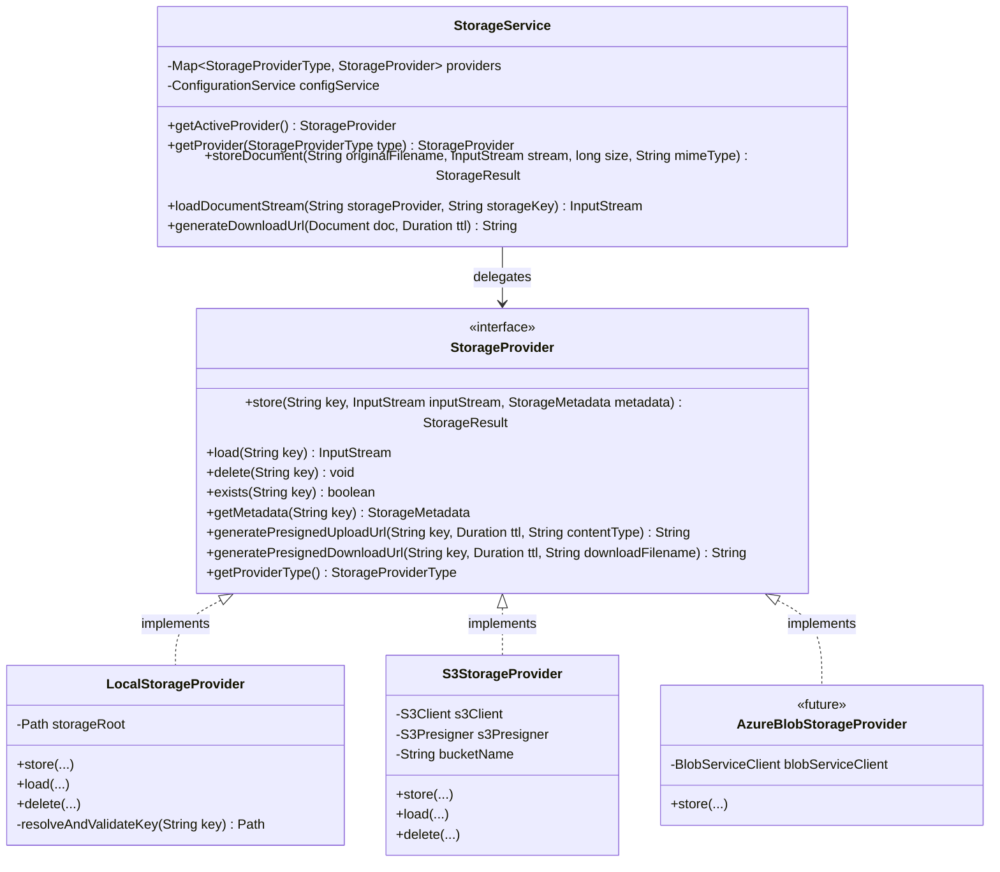
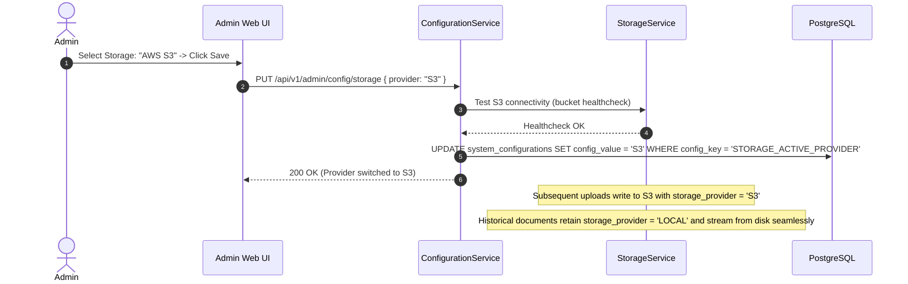

# 05 - Storage Abstraction Design

## 1. Storage Abstraction Principles

The storage layer isolates all business logic from physical file persistence. Neither the document service, ingestion workers, nor controllers interact with file systems or cloud SDKs directly. Instead, all operations execute through a unified Service Provider Interface (SPI): **`StorageProvider`**.

### Core Requirements Satisfied:
1. **Dynamic Provider Switching**: The administrator can switch between `LOCAL` and `S3` persistence at runtime via the Admin UI.
2. **Backward Compatibility**: Documents store their `storage_provider` identifier in the database record. If the system switches from `LOCAL` to `S3`, previously uploaded files remain retrievable from local disk, while new files persist to S3.
3. **Pluggable Architecture**: Adding future storage backends (e.g. MinIO, Azure Blob Storage, Google Cloud Storage) requires only implementing the `StorageProvider` interface and registering the bean.
4. **Direct Cloud Upload / Download**: The abstraction supports pre-signed upload and download URLs for cloud engines, avoiding server bandwidth bottlenecks on multi-gigabyte files.

---

## 2. Storage SPI Class Diagram & Interface Definition



### 2.1 Java Interface Definition

```java
package com.edrms.backend.storage;

import java.io.InputStream;
import java.time.Duration;

public interface StorageProvider {
    
    StorageResult store(String key, InputStream inputStream, StorageMetadata metadata);

    InputStream load(String key);

    void delete(String key);

    boolean exists(String key);

    StorageMetadata getMetadata(String key);

    String generatePresignedUploadUrl(String key, Duration ttl, String contentType);

    String generatePresignedDownloadUrl(String key, Duration ttl, String downloadFilename);

    StorageProviderType getProviderType();
}
```

---

## 3. Provider Implementations

### 3.1 Local Filesystem Provider (`LocalStorageProvider`)

Designed for on-premises, air-gapped, or development deployments:
- **Root Directory**: Configured via `STORAGE_LOCAL_ROOT_PATH` (e.g. `/var/data/edrms/storage`).
- **Partitioning Strategy**: Keys are partitioned by date and UUID to prevent filesystem inode limits in a single directory:
  `{year}/{month}/{day}/{documentUuid}/{version}_{filename}`
- **Security & Path Traversal Defense**:
  ```java
  private Path resolveAndValidateKey(String key) {
      Path resolvedPath = this.storageRoot.resolve(key).normalize();
      if (!resolvedPath.startsWith(this.storageRoot)) {
          throw new SecurityException("Potential Path Traversal Attack detected: " + key);
      }
      return resolvedPath;
  }
  ```
- **Atomic Writes**: Incoming streams are written to a `.tmp` file in a scratch directory, checksum-verified against incoming SHA-256, and then moved atomically via `Files.move(..., ATOMIC_MOVE)`.

### 3.2 AWS S3 Provider (`S3StorageProvider`)

Designed for cloud native deployments:
- **AWS SDK v2**: Built on non-blocking `S3Client` and `S3Presigner`.
- **Environment Driven**: Configured via:
  - `AWS_REGION`
  - `AWS_S3_BUCKET_NAME`
  - `AWS_ACCESS_KEY_ID` / `AWS_SECRET_ACCESS_KEY` (or AWS IAM Role / IRSA in EKS)
- **Encryption**: Enforces Server-Side Encryption (`ServerSideEncryption.AES256` or `aws:kms`).
- **Presigned URLs**:
  - `generatePresignedUploadUrl(...)`: Allows browser and scanner agent to push large binaries directly to S3, returning an ETag to the backend for registration.
  - `generatePresignedDownloadUrl(...)`: Generates time-limited (e.g. 15-minute) signed URLs with `ResponseContentDisposition` set to clean filenames.

### 3.3 MinIO & S3-Compatible Support

Because MinIO implements the AWS S3 API, `S3StorageProvider` supports MinIO out-of-the-box by setting `AWS_S3_ENDPOINT_URL=http://minio:9000` and enabling path-style access.

---

## 4. Dynamic Provider Switching Workflow


