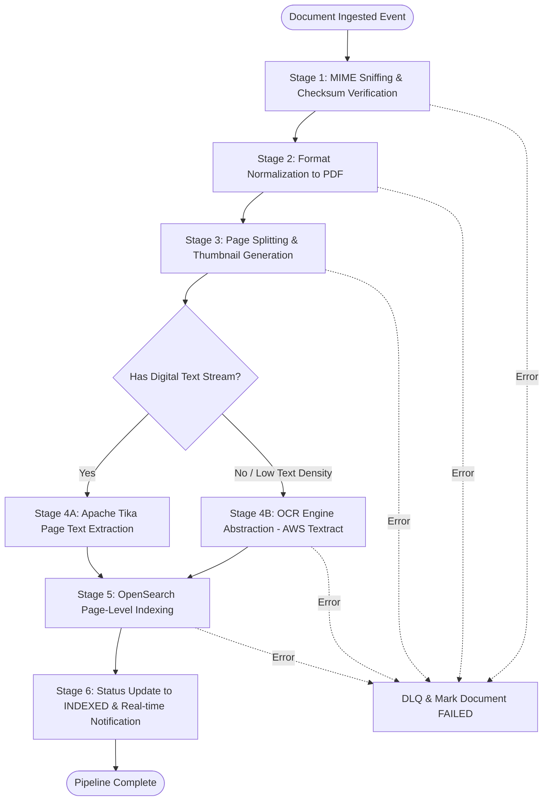
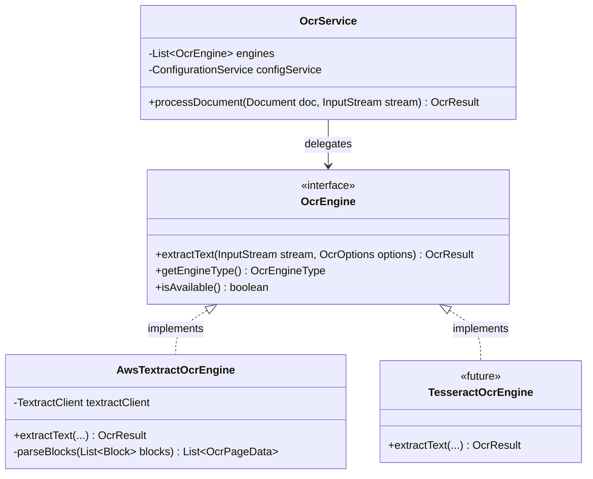

# 06 - Document-Processing Pipeline Design

## 1. Pipeline Architecture & Orchestration

Document processing is decoupled from the synchronous HTTP upload request. When a document is saved to storage, an event is emitted into the asynchronous queue, invoking the multi-stage **Document Processing Pipeline**.



---

## 2. Detailed Pipeline Stages

### Stage 1: Ingestion & Verification
- **MIME Detection**: Apache Tika detects the true MIME type using magic byte inspection (preventing file extension spoofing).
- **Integrity Validation**: SHA-256 hash is computed and verified against any client-supplied digest.
- **Safety Scanning**: Extensible hook for ClamAV / ICAP anti-malware scanning.

### Stage 2: Format Normalization to PDF
- Digital office documents (`DOC`, `DOCX`, `XLS`, `XLSX`, `PPT`, `PPTX`) are normalized into standard PDF/A format to enable uniform web-previewing and page splitting.
- Normalization engine: Headless LibreOffice container or Apache POI / PDFBox converter.
- High-resolution scanned images (`TIFF`, `BMP`, `PNG`, `JPEG`) are packed into a standardized multi-page PDF container.

### Stage 3: Page Splitting & Thumbnail Generation
- Apache PDFBox loads the normalized PDF.
- Computes `page_count`.
- Iterates over each page, rendering a 150 DPI preview, encoded into lightweight **WebP** format.
- Stores thumbnails in the active storage provider under `thumbnails/{documentId}/page_{n}.webp`.
- Populates the `document_pages` table with page dimensions (`page_width`, `page_height`) and `thumbnail_storage_key`.

### Stage 4: Text Extraction & Pluggable OCR Abstraction



#### Pluggable OCR SPI:
```java
public interface OcrEngine {
    OcrResult extractText(InputStream stream, OcrOptions options);
    OcrEngineType getEngineType();
    boolean isAvailable();
}
```

- **OCR Decision Heuristic**:
  The system examines the text extracted by Apache Tika. If a page has fewer than 20 characters of extractable text, it is classified as a scanned image and routed to the OCR engine.
- **AWS Textract Implementation**:
  - Uses `DetectDocumentText` for rapid text extraction or `StartDocumentAnalysis` for multi-page asynchronous document processing.
  - Extracts text lines and words alongside **Geometry Bounding Boxes** (`Top`, `Left`, `Width`, `Height` ratios).
  - Normalizes coordinates into percentage bounding boxes stored in JSONB in `document_pages.bbox_json`.

### Stage 5: OpenSearch Page-Level Indexing
To satisfy the requirement that **search results navigate directly to the matching document page**, OpenSearch indexes documents with page-level granularity:

#### OpenSearch Index Mapping (`edrms_documents`):
```json
{
  "mappings": {
    "properties": {
      "documentId": { "type": "keyword" },
      "folderId": { "type": "keyword" },
      "folderPath": { "type": "keyword" },
      "name": { "type": "text", "analyzer": "standard" },
      "mimeType": { "type": "keyword" },
      "fileSizeBytes": { "type": "long" },
      "createdAt": { "type": "date" },
      "pages": {
        "type": "nested",
        "properties": {
          "pageNumber": { "type": "integer" },
          "textContent": { 
            "type": "text", 
            "analyzer": "standard",
            "term_vector": "with_positions_offsets" 
          },
          "ocrConfidence": { "type": "float" }
        }
      }
    }
  }
}
```

When querying, OpenSearch executes a nested query with inner hits highlighting:
```json
{
  "query": {
    "nested": {
      "path": "pages",
      "query": {
        "match": { "pages.textContent": "indemnity clause" }
      },
      "inner_hits": {
        "highlight": {
          "fields": { "pages.textContent": {} }
        }
      }
    }
  }
}
```
The response returns the exact `pageNumber` and highlighted snippets. The web PDF previewer receives this and immediately executes:
`pdfViewer.jumpToPage(hit.pageNumber)` and highlights matching word coordinates.

### Stage 6: Status Finalization & Real-Time Notification
- Document status in PostgreSQL is updated to `INDEXED`.
- Processing task record is marked `COMPLETED`.
- Server-Sent Event (SSE) or WebSocket message is dispatched to the user's browser, prompting an automatic UI update showing the document as ready for viewing and full-text search.

---

## 3. Resilience, Retries & Dead Letter Queue (DLQ)

- If Textract hits an AWS rate limit (`ProvisionedThroughputExceededException`), the pipeline employs exponential backoff with jitter via Spring Retry.
- If a corrupted or password-protected document fails parsing, the task status is marked `FAILED` with the exact error message stored in `processing_tasks.error_message`.
- Failed tasks can be inspected and re-triggered by the administrator via `POST /api/v1/admin/processing/retry/{taskId}`.
