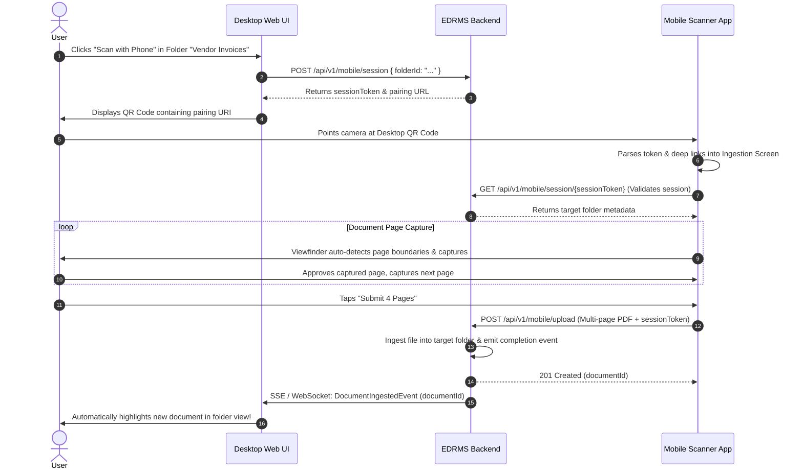

# 08 - Mobile Scanning Architecture

## 1. Overview & Mobile Architecture

The **Mobile Document Scanner** enables field staff, remote employees, and enterprise users to capture physical multi-page documents using their smartphone or tablet camera. The mobile client incorporates native document detection, edge tracking, perspective rectification, and noise filtering to generate clean, legible PDF documents comparable to flatbed scans.

```
+-----------------------------------------------------------------------------------+
| MOBILE APPLICATION (React Native / iOS & Android)                                 |
|                                                                                   |
|  [ Camera Capture Engine ]                                                        |
|  +-----------------------------------------------------------------------------+  |
|  | iOS: VisionKit (VNDocumentCameraViewController)                             |  |
|  | Android: Google ML Kit Document Scanner API                                |  |
|  +-----------------------------------------------------------------------------+  |
|                                        |                                          |
|                                        v                                          |
|  [ Real-Time Computer Vision Pipeline ]                                           |
|  +-------------------------+  +-------------------------+  +--------------------+ |
|  | Contour Edge Detection  |  | Perspective Rectify     |  | Adaptive Filtering | |
|  | (Quadrilateral Fitting) |  | (Homography Transform)  |  | (Shadow & Noise)   | |
|  +-------------------------+  +-------------------------+  +--------------------+ |
|                                        |                                          |
|                                        v                                          |
|  [ Multi-Page Batch Session & Local Storage ]                                     |
|  +-----------------------------------------------------------------------------+  |
|  | Page Reordering, Crop Refinement, Rotation, SQLite Offline Queue            |  |
|  +-----------------------------------------------------------------------------+  |
|                                        |                                          |
|                                        v                                          |
|  [ Resumable Background Uploader ]                                                |
|  +-----------------------------------------------------------------------------+  |
|  | Chunked Upload / S3 Presigned URL, Automatic Exponential Retry              |  |
|  +-----------------------------------------------------------------------------+  |
+----------------------------------------|------------------------------------------+
                                         | HTTPS POST /api/v1/mobile/upload
                                         v
+-----------------------------------------------------------------------------------+
| EDRMS BACKEND REPOSITORY SERVER                                                   |
+-----------------------------------------------------------------------------------+
```

---

## 2. Real-Time Computer Vision Pipeline

1. **Edge & Contour Detection**:
   - Analyzes high-frequency luminance gradients on the live camera preview.
   - Detects the largest convex quadrilateral contour corresponding to the paper boundary.
   - Rejects non-document geometry (e.g. tabletops, cluttered backgrounds).
2. **Auto-Capture & Stability Gate**:
   - Uses device accelerometer and gyroscope readings to ensure camera stability.
   - When the document quad remains stationary for 500ms, auto-triggers high-resolution shutter capture without manual button tapping.
3. **Perspective Rectification (Dewarping)**:
   - Computes the $3 \times 3$ homography transformation matrix from the detected four corner coordinates to the standard aspect ratio rectangle.
   - Warps the trapezoidal photo into a clean orthogonal top-down page view.
4. **Adaptive Image Filtering**:
   - **Color Scan**: Normalizes white balance and enhances contrast while preserving photographic fidelity.
   - **Grayscale / B&W**: Applies adaptive Otsu binarization and morphological filtering to remove creases, shadows, and table glare, yielding crisp black text on pure white backgrounds.

---

## 3. Desktop-Mobile Pairing ("Scan with Phone" QR Flow)

To enable seamless desktop workflows without typing URLs or logging in separately on mobile:



---

## 4. Offline Resilience & Background Uploads

1. **Offline Queueing**:
   - Scanned documents are stored in local device sandboxes (`Documents/pending_scans/`) with metadata indexed in SQLite.
   - If cellular or Wi-Fi connectivity drops, scans remain safe in the offline queue.
2. **Background Sync**:
   - Uses iOS Background Tasks (`BGProcessingTask`) and Android WorkManager (`CoroutineWorker`) to upload batches in the background when connectivity is restored.
3. **Bandwidth Optimization**:
   - Scanned page images are compressed using progressive JPEG / WebP before PDF compilation, cutting upload payloads by up to 70% without sacrificing OCR text legibility.
