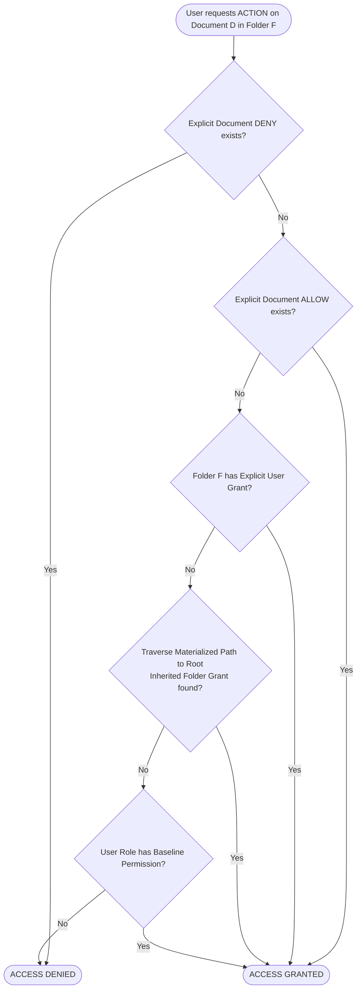

# 09 - Security and Permissions Model

## 1. Authentication Architecture (Keycloak OIDC / OAuth2)

The system delegates all identity authentication, credential storage, single sign-on (SSO), and multi-factor authentication (MFA) to **Keycloak 24**:

```
+-----------------------------------------------------------------------------------+
| KEYCLOAK IDENTITY PROVIDER                                                        |
| - Realms, OpenID Connect (OIDC), OAuth 2.0                                        |
| - Enterprise Directory Federation (Active Directory / LDAP / SAML)               |
| - Multi-Factor Authentication (TOTP, WebAuthn, FIDO2)                            |
+----------------------------------------+------------------------------------------+
                                         |
                       OIDC Auth Code    | Signed Bearer JWT
                         Flow + PKCE     | (RS256, jwks_uri)
                                         v
+-----------------------------------------------------------------------------------+
| SPRING BOOT 3 RESOURCE SERVER                                                     |
| - JwtDecoder verifies signature via Keycloak JWKS endpoint                        |
| - Extracts user claims: sub (keycloak_id), preferred_username, email, realm_roles |
| - Populates Spring SecurityContextHolder                                          |
| - Just-In-Time (JIT) syncs user record in PostgreSQL `users` table               |
+-----------------------------------------------------------------------------------+
```

---

## 2. Granular Permissions Catalog & RBAC

The system models permissions with fine-grained precision across six primary verbs and two administrative capabilities:

| Permission | Description & Scope |
| :--- | :--- |
| `VIEW` | Read metadata, list folder contents, view page thumbnails, stream inline PDF preview in browser. |
| `UPLOAD` | Upload new documents, create subfolders, upload new document revisions. |
| `DOWNLOAD` | Export and stream original binary files or receive presigned download URLs. |
| `DELETE` | Soft-delete documents or folders; move items to trash. |
| `SHARE` | Issue temporary guest share links, invite collaborators, adjust access lists. |
| `PRINT` | Authorize document printing; triggers audit event and embeds security watermark. |
| `MANAGE_PERMISSIONS` | Grant or revoke user/role access policies on a folder or document. |
| `AUDIT_READ` | Access compliance audit trails and export historical logs. |

### Baseline Role Mappings

| Role | VIEW | UPLOAD | DOWNLOAD | DELETE | SHARE | PRINT | MANAGE_PERMISSIONS | AUDIT_READ |
| :--- | :---: | :---: | :---: | :---: | :---: | :---: | :---: | :---: |
| **SUPER_ADMIN** | Yes | Yes | Yes | Yes | Yes | Yes | Yes | Yes |
| **DEPARTMENT_MANAGER**| Yes | Yes | Yes | Yes | Yes | Yes | Yes | No |
| **CONTRIBUTOR** | Yes | Yes | Yes | No | No | Yes | No | No |
| **VIEWER** | Yes | No | No | No | No | No | No | No |
| **AUDITOR** | Yes | No | No | No | No | No | No | Yes |

---

## 3. Permission Evaluation Engine & Inheritance Hierarchy

Folder permissions naturally propagate down the tree, while explicit document-level permissions allow precision overrides.



### High-Performance Hierarchy Query (PostgreSQL LTREE / Materialized Path)
Because permissions can be granted at any level of an ancestor folder tree, the evaluation engine queries all applicable grants along the materialized path in a single index lookup:

```sql
SELECT fp.permission, fp.is_inherited
FROM folder_permissions fp
JOIN folders f ON f.id = fp.folder_id
WHERE :documentMaterializedPath LIKE f.materialized_path || '%'
  AND (fp.user_id = :userId OR fp.role_id IN (:userRoleIds))
ORDER BY f.depth DESC;
```
The query scans from the most specific immediate parent folder up to the root folder, applying the most specific rule first.

---

## 4. Watermarking & Print Protection

When a user has `VIEW` or `PRINT` permission but lacks `DOWNLOAD`, the repository enforces strict data-loss prevention:

1. **Dynamic PDF Watermarking**:
   - For `/api/v1/documents/{id}/preview` and `/print-stream`, Apache PDFBox overlays a semi-transparent, non-removable diagonal watermark on every rendered page:
     ```
     CONFIDENTIAL - AUTHORIZED FOR [John Doe (jdoe@corp)]
     IP: 192.168.1.105 | DATE: 2026-09-03 11:50 UTC
     ```
2. **Client-Side Scraping Protection**:
   - The Next.js PDF previewer renders documents onto an HTML5 Canvas rather than exposing direct `<embed src="...">` tags.
   - Right-click context menus are disabled on the canvas viewport.
   - Browser print shortcut triggers (`Ctrl+P` / `Cmd+P`) are intercepted to route through the watermarked print-stream endpoint, preventing unfiltered browser page captures.

---

## 5. Temporary Access Model

External contractors, auditors, or clients who do not possess Keycloak enterprise accounts receive time-bounded, scoped access:

- **Token Generation**: Cryptographically secure 256-bit random UUID/hex string.
- **Hash at Rest**: The token is hashed with SHA-256 before storage in PostgreSQL `temporary_access_grants.token_hash`.
- **Configurable Constraints**:
  - `valid_from` & `valid_until`: Strict timestamps after which access is instantly refused.
  - `max_views`: Count-based limit (e.g. valid for at most 3 views).
  - `permissions_mask`: Restricts actions (e.g. `VIEW` only; `DOWNLOAD` forbidden).
  - `password_hash`: Optional secondary PIN/password verification using BCrypt.

---

## 6. Immutable Audit Logging

Every security-sensitive operation emits a synchronous audit record before returning to the caller.

### Tamper-Evident Hash Chaining
To prevent unauthorized database tampering, each audit log row computes a cryptographic hash over its own fields combined with the `sha256_hash` of the preceding row:

$$\text{RowHash}_i = \text{SHA256}(\text{RowHash}_{i-1} \parallel \text{TraceId} \parallel \text{ActorId} \parallel \text{Action} \parallel \text{EntityId} \parallel \text{Timestamp})$$

This creates a verifiable blockchain-like cryptographic audit chain. A daily verification job verifies the integrity of the chain and alerts the security operations team if any historical record has been modified or deleted.
